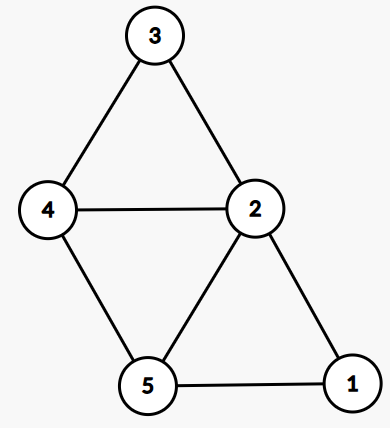
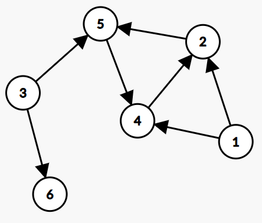
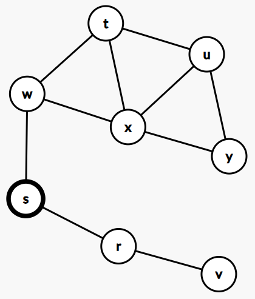
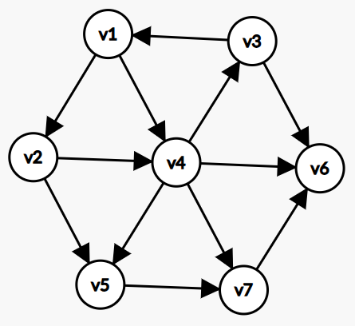
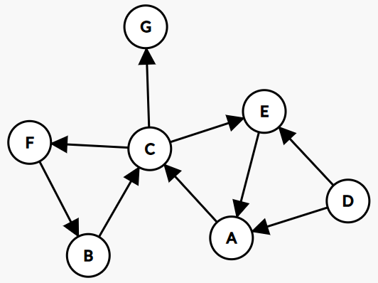
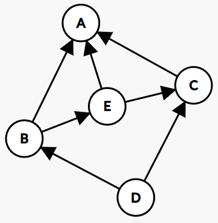
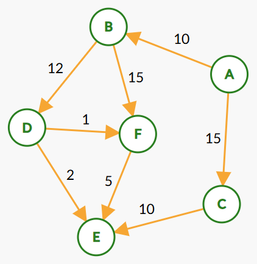
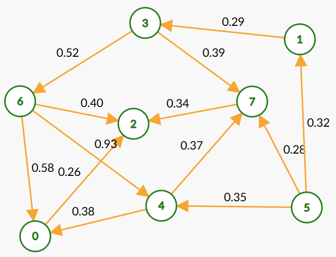

# Proteomics Toolbox

## Tuple

`Tuple` supports 9 types, from 1 value to 9 values.

## Graph

### Representation of graph

There are two standard ways to represent a graph: adjacency lists or adjacency matrix, we provide the **adjacency list** implementation.

#### Create undirected graph



```java
UndirectedGraph<Integer> graph = new UndirectedGraph<>(List.of(1, 2, 3, 4, 5));
graph.addEdge(1, 2);
graph.addEdge(1, 5);
graph.addEdge(2, 3);
graph.addEdge(2, 4);
graph.addEdge(2, 5);
graph.addEdge(3, 4);
graph.addEdge(4, 5);
System.out.println(graph);
```

```
5 nodes, 7 edges
1: 2 5 
2: 1 3 4 5 
3: 2 4 
4: 2 3 5 
5: 1 2 4 
```

#### Create directed graph



```java
Digraph<Integer> graph = new Digraph<>(List.of(1, 2, 3, 4, 5, 6));
graph.addEdge(1, 2);
graph.addEdge(1, 4);
graph.addEdge(2, 5);
graph.addEdge(3, 5);
graph.addEdge(3, 6);
graph.addEdge(4, 2);
graph.addEdge(5, 4);
System.out.println(graph);
```

```
6 nodes, 7 edges
1: 2 4 
2: 5 
3: 5 6 
4: 2 
5: 4 
6: 
```

### Graph Searching

Searching a graph means systematically following the edges of graph so as to visit the vertices of the graph.

#### Breadth-first search

Breadth-first search is one of the simplest algorithms for searching a graph and the archetype for many important graph algorithms. Prim's minimum-spanning-tree and Dijkstra's single-source shortest-paths algorithm use ideas similar to those in breadth-first search.

Breadth-first search systematically explores the edges of graph $G$ to discover every vertex that is reachable from source vertex $s$. It computes the distance (smallest number of edges) from $s$ to each reachable vertices. For any vertex $v$ reachable from $s$, the simple path in the breadth-first tree from $s$ to $v$ corresponds to a "shortest path" from $s$ to $v$.

> [!TIP]
>
> Breadth-first search works on both directed and undirected graphs.

`BreadthFirstIterator` implements the breadth-first search.

##### Iterate over undirected graph



Iterate from the source vertex $s$:

```java
UndirectedGraph<String> graph = new UndirectedGraph<>("r", "s", "t", "u",
        "v", "w", "x", "y");
graph.addEdge("r", "s");
graph.addEdge("r", "v");
graph.addEdge("s", "w");
graph.addEdge("t", "u");
graph.addEdge("t", "w");
graph.addEdge("t", "x");
graph.addEdge("u", "x");
graph.addEdge("u", "y");
graph.addEdge("w", "x");
graph.addEdge("x", "y");
List<String> nodes = new ArrayList<>();
BreadthFirstIterator<String> it = new BreadthFirstIterator<>(graph, "s");
while (it.hasNext()) {
    String node = it.next();
    nodes.add(node);
}
assertIterableEquals(List.of("s", "r", "w", "v", "t", "x", "u", "y"), nodes);
assertEquals(0, it.getDepth("s"));
assertEquals(1, it.getDepth("r"));
assertEquals(1, it.getDepth("w"));
assertEquals(2, it.getDepth("v"));
assertEquals(2, it.getDepth("t"));
assertEquals(2, it.getDepth("x"));
assertEquals(3, it.getDepth("u"));
assertEquals(3, it.getDepth("y"));
```

> [!NOTE]
>
> The result of breadth-first search may depend upon the order in which the neighbors of a given vertex are visited: the breadth-first tree may vary, but the distances $d$ computed by this algorithm will not.

If you don't need the distances, `UndirectedGraph` provides `bfs()`, which more easy to use:

```java
UndirectedGraph<String> graph = new UndirectedGraph<>("r", "s", "t", "u",
        "v", "w", "x", "y");
graph.addEdge("r", "s");
graph.addEdge("r", "v");
graph.addEdge("s", "w");
graph.addEdge("t", "u");
graph.addEdge("t", "w");
graph.addEdge("t", "x");
graph.addEdge("u", "x");
graph.addEdge("u", "y");
graph.addEdge("w", "x");
graph.addEdge("x", "y");
List<String> nodes = graph.bfs("s");
assertIterableEquals(List.of("s", "r", "w", "v", "t", "x", "u", "y"), nodes);
```

##### Shortest paths

The shortest-path from $s$ to $v$ is the minimum number of edges in any path from vertex $s$ to vertex $v$.

The breadth-first tree is automatically the shortest path.

`BreadFirstShortestPath` class provides auxiliary methods related to path query, and is applicable to directed and undirected graphs.



```java
String v1 = "v1";
String v2 = "v2";
String v3 = "v3";
String v4 = "v4";
String v5 = "v5";
String v6 = "v6";
String v7 = "v7";

Digraph<String> graph = new Digraph<>(v1, v2, v3, v4, v5, v6, v7);

graph.addEdge(v1, v2);
graph.addEdge(v1, v4);
graph.addEdge(v2, v4);
graph.addEdge(v2, v5);
graph.addEdge(v3, v1);
graph.addEdge(v3, v6);
graph.addEdge(v4, v3);
graph.addEdge(v4, v5);
graph.addEdge(v4, v6);
graph.addEdge(v4, v7);
graph.addEdge(v5, v7);
graph.addEdge(v7, v6);

BreadFirstShortestPath<String> path = new BreadFirstShortestPath<>(graph, v3);
assertEquals(1, path.getWeight(v1));
assertEquals(2, path.getWeight(v2));
assertEquals(0, path.getWeight(v3));
assertEquals(2, path.getWeight(v4));
assertEquals(3, path.getWeight(v5));
assertEquals(1, path.getWeight(v6));
assertEquals(3, path.getWeight(v7));

assertEquals(v3, path.getParentNode(v1));
assertEquals(v1, path.getParentNode(v2));
assertEquals(null, path.getParentNode(v3));
assertEquals(v1, path.getParentNode(v4));
assertEquals(v2, path.getParentNode(v5));
assertEquals(v3, path.getParentNode(v6));
assertEquals(v4, path.getParentNode(v7));

GraphPath<String> p7 = path.getPath(v7);
assertIterableEquals(List.of(v3, v1, v4, v7), p7.nodeList());
```

#### Depth-first search



```java
Digraph<String> digraph = new Digraph<>("A", "B", "C", "D", "E", "F", "G");
digraph.addEdge("A", "C");
digraph.addEdge("B", "C");
digraph.addEdge("C", "E");
digraph.addEdge("C", "F");
digraph.addEdge("C", "G");
digraph.addEdge("D", "A");
digraph.addEdge("D", "E");
digraph.addEdge("E", "A");
digraph.addEdge("F", "B");

DepthFirstIterator<String> it = new DepthFirstIterator<>(digraph, "D");
while (it.hasNext()){
    String node = it.next();
}
```

> [!NOTE]
>
> Same as BFS, the result of depth-first search also depend upon the order in which the neighbors of a given vertex are visited.

#### Topological sort

A topological sort of a directed acyclic graph (DAG) is a linear order of all its vertices such that if $G$ contains an edge $(u,v)$, then $u$ appears before $v$ in the ordering.

Topological sorting is provided as an instance method in `Digraph` as `topological()`.



```java
Digraph<String> graph = new Digraph<>("A", "B", "C", "D", "E");
graph.addEdge("B", "A");
graph.addEdge("B", "E");
graph.addEdge("C", "A");
graph.addEdge("D", "B");
graph.addEdge("D", "C");
graph.addEdge("E", "A");
graph.addEdge("E", "C");
List<String> nodeList = new ArrayList<>();
graph.topological(nodeList::add);
assertIterableEquals(List.of("D", "B", "E", "C", "A"), nodeList);
```

### Single-source shortest paths

In a shorted-path problem, we are given a **directed weighted graph**.

The breadth-first-search algorithm is a shorted-paths algorithm that works on unweighted graphs, that is graphs in which each edge has unit weight.

Single-source shortest-path problem: given a graph $G(V,E)$, we want to find a shortest path from a given source vertex $s\in V$ to each vertex $v\in V$. variants:

- **single-destination shortest-path problem**: find a shortest path to a given destination vertex $t$ from each vertex $s$. By reversing the direction of each edge in the graph, we can reduce this problem to a single-source problem.
- **single-pair shortest-path problem**: find a shortest path from $u$ to $v$ for given vertices  $u$ and $v$. If we solve the single-source problem with source vertex $u$, we solve this problem also. Moreover, all known algorithms for this problem have the same worst-case asymptotic running time as the best single-source algorithms.
- all-pair shortest-path problem: Find a shortest path from $u$ to $v$ for every pair of vertices $u$ and $v$.

> [!IMPORTANT]
>
> If the graph $G=(V,E)$ contains no negative-weight cycles reachable from the source $s$, then for all $v\in V$, the shortest-path weight $\delta(s,v)$ remains well defined, even if it has a negative value.
>
> If the graph contains a negative-weight cycle reachable from $s$, shortest-path weights are not well defined.

> [!NOTE]
>
> Shortest paths are not necessarily unique.

#### Dijkstra's algorithm

> [!TIP]
>
> - For directed weighted graph
> - This algorithm assume that all edge weights are nonnegative.
> - allow cycle



```java
Digraph<String> g = new Digraph<>(List.of("A", "B", "C", "D", "E", "F"));
g.addEdge("A", "B", 10);
g.addEdge("A", "C", 15);
g.addEdge("B", "D", 12);
g.addEdge("B", "F", 15);
g.addEdge("C", "E", 10);
g.addEdge("D", "E", 2);
g.addEdge("D", "F", 1);
g.addEdge("F", "E", 5);

DijkstraShortestPath<String> path = new DijkstraShortestPath<>(g, "A");
assertIterableEquals(List.of("A", "B"), path.getPath("B").nodeList());
assertIterableEquals(List.of("A", "C"), path.getPath("C").nodeList());
assertIterableEquals(List.of("A", "B", "D"), path.getPath("D").nodeList());
assertIterableEquals(List.of("A", "B", "D", "E"), path.getPath("E").nodeList());
assertIterableEquals(List.of("A", "B", "D", "F"), path.getPath("F").nodeList());

assertEquals(0, path.getWeight("A"));
assertEquals(10, path.getWeight("B"));
assertEquals(15, path.getWeight("C"));
assertEquals(22, path.getWeight("D"));
assertEquals(24, path.getWeight("E"));
assertEquals(23, path.getWeight("F"));
```

#### Bellman-Ford algorithm

> [!TIP]
>
> - For directed weighted graph
> - Edge weights can be negative
> - Slower than Dijkstra's algorithm

Bellman-Ford algorithm allow negative-weight edges in the graph, and produce a correct answer as long as no negative-weight cycles are reachable from the source. If there is such a negative-weight cycle, the algorithm can detect and report its existence.

```java
Digraph<String> g = new Digraph<>(List.of("A", "B", "C", "D", "E"));
g.addEdge("A", "C", 4);
g.addEdge("A", "E", 5);
g.addEdge("B", "C", -4);
g.addEdge("C", "A", -3);
g.addEdge("D", "A", 4);
g.addEdge("D", "C", 7);
g.addEdge("D", "E", 3);
g.addEdge("E", "C", 3);
g.addEdge("E", "B", 2);

BellmanFordShortestPath<String> shortestPath = new BellmanFordShortestPath<>(g, "D");
assertEquals(-2, shortestPath.getWeight("A"), 1E-10);
assertEquals(5, shortestPath.getWeight("B"), 1E-10);
assertEquals(1, shortestPath.getWeight("C"), 1E-10);
assertEquals(0, shortestPath.getWeight("D"), 1E-10);
assertEquals(3, shortestPath.getWeight("E"), 1E-10);
```

#### DAG

Shortest path are always well defined in a directed acyclic graph (DAG).



```java
Digraph<Integer> digraph = new Digraph<>(ArrayUtils.rangeClosed(0, 7));
digraph.addEdge(5, 4, 0.35);
digraph.addEdge(4, 7, 0.37);
digraph.addEdge(5, 7, 0.28);
digraph.addEdge(5, 1, 0.32);
digraph.addEdge(4, 0, 0.38);
digraph.addEdge(0, 2, 0.26);
digraph.addEdge(3, 7, 0.39);
digraph.addEdge(1, 3, 0.29);
digraph.addEdge(7, 2, 0.34);
digraph.addEdge(6, 2, 0.40);
digraph.addEdge(3, 6, 0.52);
digraph.addEdge(6, 0, 0.58);
digraph.addEdge(6, 4, 0.93);

DAGShortestPath<Integer> path = new DAGShortestPath<>(digraph, 5);
GraphPath<Integer> p0 = path.getPath(0);
assertEquals(0.73, p0.weight());
assertIterableEquals(List.of(5, 4, 0), p0.nodeList());

GraphPath<Integer> p1 = path.getPath(1);
assertEquals(0.32, p1.weight());
assertIterableEquals(List.of(5, 1), p1.nodeList());

GraphPath<Integer> p2 = path.getPath(2);
assertEquals(0.62, p2.weight(), 1e-10);
assertIterableEquals(List.of(5, 7, 2), p2.nodeList());

GraphPath<Integer> p3 = path.getPath(3);
assertEquals(0.61, p3.weight(), 1e-10);
assertIterableEquals(List.of(5, 1, 3), p3.nodeList());

GraphPath<Integer> p4 = path.getPath(4);
assertEquals(0.35, p4.weight(), 1e-10);
assertIterableEquals(List.of(5, 4), p4.nodeList());

GraphPath<Integer> p5 = path.getPath(5);
assertEquals(0., p5.weight(), 1e-10);
assertIterableEquals(List.of(5), p5.nodeList());

GraphPath<Integer> p6 = path.getPath(6);
assertEquals(1.13, p6.weight(), 1e-10);
assertIterableEquals(List.of(5, 1, 3, 6), p6.nodeList());

GraphPath<Integer> p7 = path.getPath(7);
assertEquals(0.28, p7.weight(), 1e-10);
assertIterableEquals(List.of(5, 7), p7.nodeList());
```

